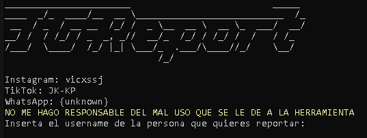

# IGReport

  

## Objetivo de la herramienta
-Esta herramienta consiste en seguir indefinidamente un usuario, al punto de que instagram detecte los seguidores del usuario como bots pagados o que el mismo los uso en su cuenta, lo cual es ilegal. Instagram puede llegar a banear la cuenta. Debes usar VPN, ya que como dije antes es ilegal, y deben protegerse de cualquier peligro.

## Instalacion
1.-git clone https://github.com/VicxWhat/IGReport
2.-cd IGReport
3.-pip install -r requirements.txt
4.-python IGReport.py

### NO ME HAGO RESPONSABLE DEL MAL USO QUE SE LE DE A MI HERRAMIENTA, TODO QUEDA A CARGO DEL QUE LA USE
